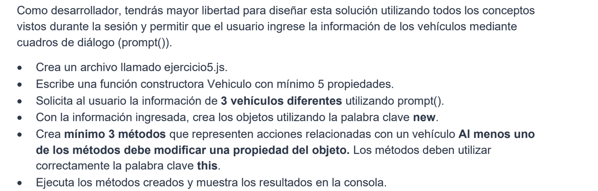

# lab-constructoresjs-generationcol-coh15
# Ejercicio 1
## Pregunta
Que ventaja analitica tiene crerar una funcion constricuta en lugar de escribir un objetbo literal estrutictare indivualemnte para cada computador?  

R// es mejor usar una funcion constructora para mantener el codigo limpio y eficiente y usar el principio de reutilizacion del codigo para evitar asi como en la escritura del ingles u otro idioma redundar y crear confusion por ello

# Ejercicio 2
## Pregunta
Por que un metodo interno puede accceder de manera precisa y aislada a las propiedades especificas de su propio obejeto utilizandfo la palabra clave this?  

R// el valor de this no se define cuando escribes la función, sino en el momento en que la función es ejecutada, cuando eso pasa  JavaScript establece automáticamente que this apunte al objeto que está inmediatamente a la derecha del punto.

# Ejercicio 3
## Pregunta
Que ventajas a nivel  de cohesion de software representa el hecho de que el objeto conozca por si mismo su estado logico (si aporobo o no)?  

R// Considero que la ventaja que genera es que haces el codigo 1 vez y lo usas las veces que desees/necesites, siempre que el constructor se ejecute asi mismo ejecutara la funcion de revision true o false de este caso si aprobo el curso pero puede aprovar muchas otras y esa funcion puede convertirse en otros tipos de funciones etc, me parece una forma de autorecursividad y practicidad que tiene js

# Ejercicio 4
## Pregunta
Que ocurriria si el libro ya estaba prestado y alguien intenta prestarlo nuevamente sin controles de estado internos?  

R// Sin controles adecuados, el programa lo prestaria de nuevo auqnue ya el valor de la variable prestado fuera true, no sacaria alerta, y quedaria en un estado 
inconsistente pues dos personas creerian tener el mismo libro y al devolverlo no se sabria quien lo tiene en realidad

# Ejercicio 5
## Pregunta
Que ventajas tiene permitir que la informacion sea ingresada por el usuario en lugar de  escribir los datos directamente en el codigo?  

R// 
